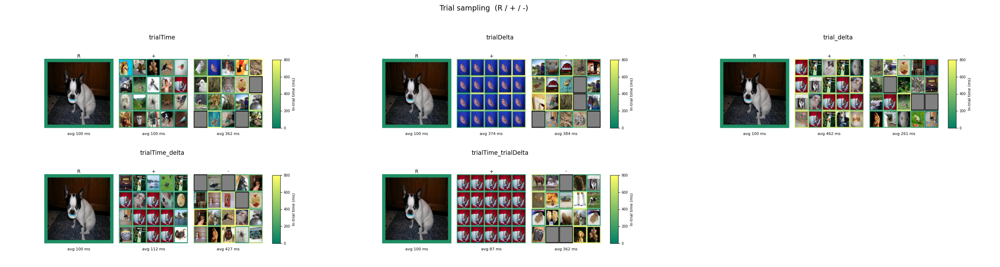
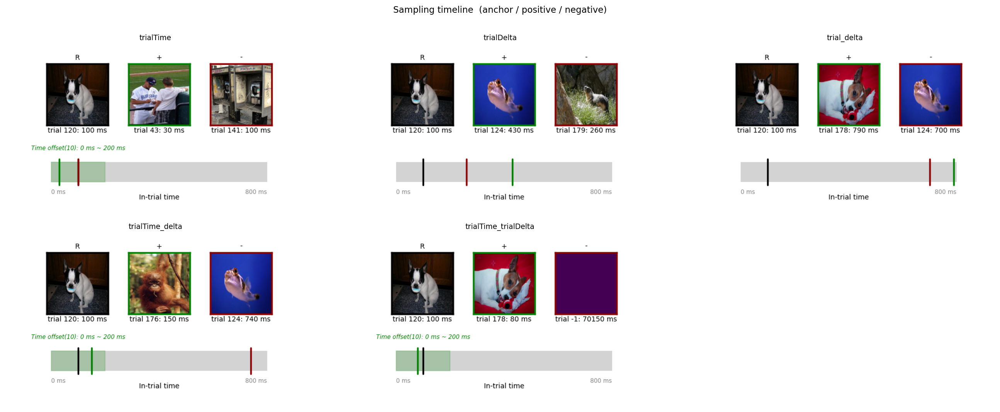
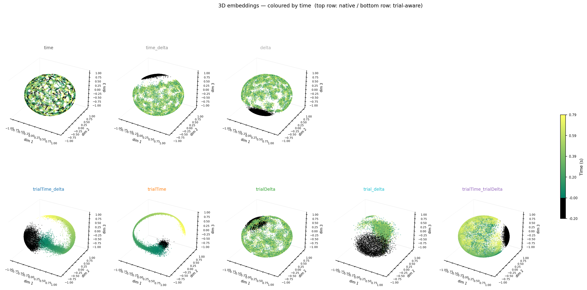
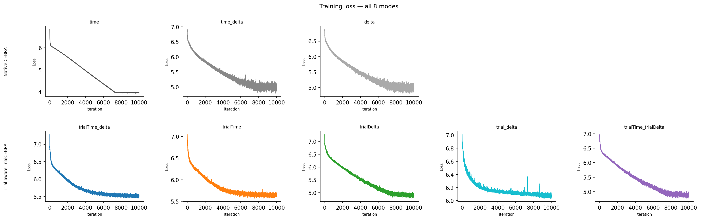

# TrialCEBRA
[](https://pypi.org/project/TrialCEBRA/)
[](https://github.com/colehank/TrialCEBRA/actions)  
[English | [中文](README_zh.md)]

**Trial-aware contrastive learning for CEBRA** — a wrapper that adds three trial-structured sampling conditionals to [CEBRA](https://cebra.ai) without modifying its source code.

Designed for neuroscience experiments where neural recordings are organized as repeated trials (stimuli, conditions, epochs). Positive-pair selection is lifted from the *timepoint* level to the *trial* level: first select a target trial by stimulus similarity or at random, then draw a positive timepoint within that trial.

---

## Background

CEBRA's native conditionals (`time`, `delta`, `time_delta`) operate over a flat sequence of timepoints. For trial-structured data they have two limitations:

1. **Temporal boundary artifacts** — a 1-D CNN convolves across trial boundaries, mixing pre- and post-stimulus activity.
2. **Flat sampling ignores trial structure** — `delta` finds the nearest-neighbor timepoint in stimulus space; when all timepoints within a trial share the same stimulus embedding, this collapses to intra-trial sampling with no cross-trial signal.

`trial_cebra` solves both by lifting positive-pair selection to the *trial* level.

---

## Installation

**Step 1 — Install PyTorch** for your hardware from [pytorch.org](https://pytorch.org/get-started/locally/) (select your CUDA version or CPU).

**Step 2 — Install TrialCEBRA:**

```bash
pip install TrialCEBRA
```

---

## Quick Start

```python
import numpy as np
from trial_cebra import TrialCEBRA

# Epoch-format neural data: (ntrial, ntime, nneuro)
X = np.random.randn(40, 50, 64).astype(np.float32)

# Trial-level stimulus embedding: (ntrial, stim_dim)
y = np.random.randn(40, 16).astype(np.float32)

model = TrialCEBRA(
    model_architecture     = "offset10-model",
    conditional            = "delta",   # trial-similarity sampling
    time_offsets           = 5,
    delta                  = 0.3,
    sample_fix_trial       = False,
    sample_exclude_intrial = True,
    output_dimension       = 3,
    max_iterations         = 1000,
    batch_size             = 512,
)

model.fit(X, y)                        # X: 3-D, trial boundaries inferred automatically
embeddings = model.transform_epochs(X) # (ntrial, ntime, 3)
```

**Label shape contract by conditional:**

| `conditional` | y shape | Interpretation |
|---|---|---|
| `"time"` | not required | random trial + ±`time_offsets` window |
| `"delta"` | `(ntrial, nd)` or `(ntrial, ntime, nd)` | trial-level OR per-timepoint label (3-D enables class-conditional trial selection with `y_discrete`) |
| `"time_delta"` | `(ntrial, ntime, nd)` | timepoint-level label |

---

## Conditionals

Three trial-aware conditionals mirroring CEBRA's originals, lifted to the trial level:

| `conditional` | Trial selection | Within-trial | y required | `sample_fix_trial` | `sample_exclude_intrial` |
|---|---|---|---|---|---|
| `"time"` | Random (uniform) | ±`time_offsets` | No | ignored | ✓ |
| `"delta"` | Gaussian similarity on y (class-conditional when `y_discrete` + 3-D `y`) | Uniform (free) | `(ntrial, nd)` or `(ntrial, ntime, nd)` | ✓ | ✓ |
| `"time_delta"` | Joint argmin over cross-trial candidates | ±`time_offsets` | `(ntrial, ntime, nd)` | ✓ | ✓ |

`sample_fix_trial` (default `False`) controls whether the trial→trial mapping is pre-computed once at init (`True`) or re-sampled at every training step (`False`). Has no effect for `"time"`.

`sample_exclude_intrial` (default `True`) controls whether the anchor's own trial is excluded from positive sampling. When `False`, positives may be drawn from any trial including the anchor's own.

Native CEBRA conditionals pass through unchanged when flat 2-D data is provided.

---

## How Sampling Works

### `"time"` — random trial + time window

Target trial is drawn uniformly at random (≠ own trial) using the Gumbel-max trick. A positive timepoint is then sampled within ±`time_offsets` of the anchor's relative position in the target trial.

### `"delta"` — Gaussian similarity + uniform within trial

Mirrors CEBRA's `DeltaNormalDistribution` at the trial level:

```
query        = y[anchor_trial] + N(0, δ²I) / √d
target_trial = argmin_j  dist(query, y[j]),  j ≠ anchor
```

`y` accepts either shape `(ntrial, nd)` (per-trial) or `(ntrial, ntime, nd)` (per-timepoint). `δ` controls the exploration radius. A positive timepoint is sampled **uniformly** from the selected trial.

**Discrete-first class-conditional trial selection** (when `y_discrete` is supplied): following CEBRA's `ConditionalIndex` design, the trial-selection basis switches to the anchor's own class:

* **Mode A** — `y_discrete` is per-trial (constant within each trial): candidates are restricted to trials that share the anchor's class.
* **Mode B** — `y_discrete` is per-timepoint AND `y` is 3-D: `trial_emb_per_class[c][trial] = mean(y[trial, t] for t where class(trial, t) == c)`. The anchor uses its own class's basis.
* **Mode C** — `y_discrete` is per-timepoint but `y` is only 2-D: a warning is emitted and trial selection falls back to class-agnostic `y`. To enable full class-conditional selection, pass 3-D `y`.

In all modes a tiny Gumbel perturbation is added before `argmin` to break ties stochastically (e.g., when all trials share the same class-c embedding, as happens for pre-stim gray-screen labels).

### `"time_delta"` — joint argmin over cross-trial candidates

For each anchor at `(trial_i, rel_i)`, the candidate pool is every timepoint in every other trial that falls within ±`time_offsets` of `rel_i`:

```
candidates = {(trial_j, t) : trial_j ≠ trial_i,  |t − rel_i| ≤ time_offsets}
query      = y[trial_i, rel_i] + N(0, δ²I) / √d
positive   = argmin_{(trial_j, t) ∈ candidates}  dist(y[trial_j, t], query)
```

`y` (shape `(ntrial, ntime, nd)`) is used directly as a per-timepoint label — no aggregation. The positive sample simultaneously satisfies three constraints: **cross-trial**, **time-aligned** (within ±`time_offsets`), and **label-similar**.

On static stimuli (y constant within a trial) the argmin degrades gracefully to delta-style trial selection followed by uniform time-window sampling — no special handling required.

**`fix_trial=True`**: the target trial is locked at init using the same Gaussian-similarity query as `"delta"` (on trial-onset embeddings `y[:, 0, :]`). At each step the within-trial timepoint is the argmin of y-distance inside the ±`time_offsets` window of the locked trial.

### `sample_fix_trial`

| | `sample_fix_trial=False` (default) | `sample_fix_trial=True` |
|---|---|---|
| Target trial | Re-sampled independently every training step | Pre-computed once at `__init__`, fixed |
| Gradient signal | Diverse — anchor sees different similar trials | Consistent — same trial pair repeated |
| Best for | Many trials, rich stimulus content | Few trials, stable training |

---

## Visualizing Sampling Behavior

The figures below are produced by `example/viz_trial_sampling.py` on real MEG data with ImageNet stimuli. Each panel shows **R** (reference anchor), **+** (positive samples), **−** (negative samples).

### Trial sampling: R / + / −



- **`time`** — positives from a uniformly random other trial, centered near the anchor's relative time position.
- **`delta`** — positives from a trial selected by Gaussian similarity on trial embeddings (`fix_trial=False`: target trial varies each step). When `y_discrete` is provided, the selection becomes class-conditional (discrete-first principle).
- **`time_delta`** — same velocity-based trial selection, additionally constrained to ±`time_offsets` of the anchor's relative position.

### Sampling timeline



Each sampled frame is placed on a timeline spanning the full trial duration. The green band marks the ±`time_offsets` window around the anchor's relative position.

---

## Learned Embeddings

All six conditionals (3 native CEBRA + 3 trial-aware) trained on the same MEG dataset. Points colored by **in-trial time**.

### 3D embeddings colored by time



**Native CEBRA (top row):** `time` — uniform sphere, no temporal structure. `delta` — stimulus content dominates; flat within-trial structure. `time_delta` — weak temporal gradients.

**Trial-aware TrialCEBRA (bottom row):** `time` — temporal ring from cross-trial alignment. `delta` — clean trial clustering by stimulus similarity. `time_delta` — sharpest per-latency structure.

### Training loss



All conditionals converge smoothly. Trial-aware conditionals start at higher loss (richer contrastive task) and converge to a similar level as native conditionals.

---

## Label Broadcasting (Epoch Format)

When `X` is 3-D `(ntrial, ntime, nneuro)`, labels are broadcast to flat format automatically:

| Label shape | Interpretation | Flat output shape |
|---|---|---|
| `(ntrial,)` | per-trial discrete | `(ntrial*ntime,)` |
| `(ntrial, d)` where `d ≠ ntime` | per-trial continuous | `(ntrial*ntime, d)` |
| `(ntrial, ntime)` | per-timepoint | `(ntrial*ntime,)` |
| `(ntrial, ntime, d)` | per-timepoint | `(ntrial*ntime, d)` |

---

## Multi-session training

TrialCEBRA supports CEBRA's multi-session paradigm on top of trial-aware sampling. Pass `X` as a **list** of epoch-format arrays (one per session) and auxiliary labels as parallel lists:

```python
# 2 sessions, potentially different (ntrial, ntime, nneuro) per session
X = [
    np.random.randn(30, 100, 64).astype(np.float32),   # session 0
    np.random.randn(25,  80, 48).astype(np.float32),   # session 1 (different shape OK)
]
y_cont = [np.random.randn(30, 100, 16).astype(np.float32),
          np.random.randn(25,  80, 16).astype(np.float32)]
y_disc = [np.zeros((30, 100), dtype=np.int64), np.zeros((25, 80), dtype=np.int64)]
# ... populate pre/post classes in y_disc ...

model = TrialCEBRA(conditional="delta", max_iterations=1000, output_dimension=3, ...)
model.fit(X, y_disc, y_cont)   # auto-detects multisession from list-of-arrays
```

### CEBRA philosophy, preserved

Alignment comes from the **cross-session query shuffle** (see `cebra.distributions.multisession.MultisessionSampler`): each session computes its own query in y-space, queries are redistributed across sessions so every positive is found in a **different** session than its anchor, encoders are forced to map semantically equivalent states to nearby points. `mix` / `index_reversed` re-align ref ↔ pos for the contrastive loss.

### What's supported

| Conditional | Multisession | Behavior |
|---|---|---|
| `"delta"` | ✓ full support | Mode A / Mode B class-conditional trial selection per session; cross-session shuffle; same-class constraint enforced across sessions |
| `"time_delta"` | ✓ | joint argmin in y-space; **±`time_offsets` window is dropped** (relative time positions don't transfer across sessions with heterogeneous `ntime`) |
| `"time"` | ✗ `NotImplementedError` | matches CEBRA native — `_init_loader` rejects multisession without a behavioural index |

### Constraints (validated at init)

- **≥ 2 sessions**; heterogeneous `(ntrial_s, ntime_s, nneuro_s)` allowed
- All sessions share the same continuous y feature dim (`nd`)
- If `y_discrete` is provided, all sessions must share the **same sorted unique class set**
- **Mode C** (per-timepoint discrete + 2-D y_continuous) is **not allowed** in multisession — pass 3-D y_continuous for every session
- Strict cross-session: every positive comes from a session different from its anchor's (per-batch-position derangement of queries)

### `sample_exclude_intrial` in multisession

At the sampler layer, cross-session is strict, so per-session `sample_exclude_intrial` is effectively superseded. Internally each per-session `TrialAwareDistribution` is built with `sample_exclude_intrial=False` to avoid redundant masking.

---

## API Reference

### `TrialCEBRA`

Inherits all parameters from `cebra.CEBRA`. Key additions:

```python
TrialCEBRA(
    conditional: str,                    # "time", "delta", "time_delta", or any native CEBRA conditional
    time_offsets: int,                   # half-width of the within-trial time window
    delta: float,                        # Gaussian noise std for trial similarity matching
    sample_fix_trial: bool = False,      # pre-compute trial→trial mapping at init
    sample_exclude_intrial: bool = True, # exclude anchor's own trial from positive sampling
    **cebra_kwargs,
)

# Epoch format — trial boundaries inferred automatically
model.fit(X, *y)           # X: (ntrial, ntime, nneuro)
model.fit_epochs(X, *y)    # convenience alias

model.transform(X)         # → np.ndarray (N, output_dimension)
model.transform_epochs(X)  # → np.ndarray (ntrial, ntime, output_dimension)
model.distribution_        # TrialAwareDistribution instance (after fit)
```

### `TrialAwareDistribution`

The sampling distribution; can be used standalone for diagnostics.

```python
from trial_cebra import TrialAwareDistribution
import torch

dist = TrialAwareDistribution(
    ntrial                 = 40,
    ntime                  = 50,
    conditional            = "delta",
    y                      = torch.randn(40, 16),   # (ntrial, nd)
    sample_fix_trial       = False,
    sample_exclude_intrial = True,
    time_offsets           = 10,
    delta                  = 0.3,
    device                 = "cpu",
    seed                   = 42,
)

ref = dist.sample_prior(num_samples=64)
pos = dist.sample_conditional(ref)
```

### `flatten_epochs`

Converts epoch-format arrays to flat format with trial metadata.

```python
from trial_cebra import flatten_epochs

X_flat, y_flat, trial_starts, trial_ends = flatten_epochs(X_ep, y_ep)
# X_ep: (ntrial, ntime, nneuro) → X_flat: (ntrial*ntime, nneuro)
```

### `TrialTensorDataset`

Low-level PyTorch dataset with trial metadata, for use outside the sklearn interface.

```python
from trial_cebra import TrialTensorDataset

dataset = TrialTensorDataset(
    neural       = neural_tensor,
    continuous   = stim_tensor,
    trial_starts = starts_tensor,
    trial_ends   = ends_tensor,
    device       = "cpu",
)
```

---

## Implementation Notes

**Post-replace distribution** — `TrialCEBRA` does not modify CEBRA's source. Instead it temporarily sets `conditional = "time_delta"` to pass CEBRA's internal validation, calls `super()._prepare_loader(...)` to obtain a standard loader, then replaces `loader.distribution` with a `TrialAwareDistribution` in-place. Both loader types call only `distribution.sample_prior` and `distribution.sample_conditional` inside `get_indices`, so the replacement is fully transparent to the training loop.

The conditional name overlap (`"time"` and `"time_delta"` are both CEBRA native and TrialCEBRA names) is resolved by checking for trial metadata on the dataset: TrialCEBRA only activates the trial-aware path when `trial_starts`/`trial_ends` are present on the dataset, ensuring native CEBRA behavior is preserved for flat 2-D inputs.

---

## Project Structure

```
src/trial_cebra/
  __init__.py       public API: TrialCEBRA, TrialTensorDataset, TrialAwareDistribution, flatten_epochs
  cebra.py          TrialCEBRA sklearn estimator
  dataset.py        TrialTensorDataset (PyTorch dataset)
  distribution.py   TrialAwareDistribution (three trial-aware conditionals)
  epochs.py         flatten_epochs utility

tests/
  test_cebra.py
  test_dataset.py
  test_distribution.py
  test_epochs.py
```

---

## Contributing

**Setup** (run once after cloning):

```bash
uv sync --dev
uv run pre-commit install --hook-type pre-commit --hook-type pre-push
```

**CI checks** run automatically on every push to `main`:

| Check | Command |
|---|---|
| Lint + format | `ruff check . && ruff format --check .` |
| Tests | `pytest tests/ -v` |

**Releasing a new version** — version is derived from the git tag, no files need editing:

```bash
git tag vx.x.x
git push origin vx.x.x   # triggers build + publish to PyPI
```
